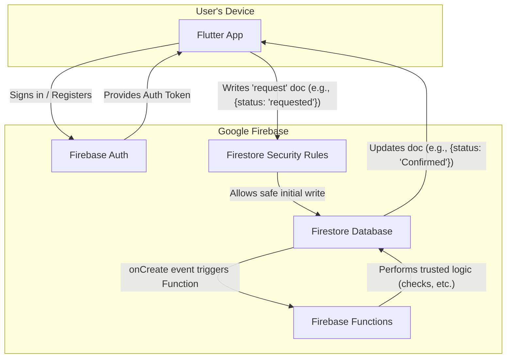

# GetSpot High-Level Architecture

This document outlines the "write-to-trigger" architectural model for the GetSpot application, detailing the flow of data and control between the client, database, and backend logic.

## Architectural Flow Explained

This architecture uses a **"write-to-trigger"** pattern for handling sensitive operations, providing excellent resilience and user experience.

*   **Authentication:** The user signs in via the **Flutter App**, which communicates with **Firebase Auth** to get a secure ID Token.

*   **Simple Reads:** For reading public data (like event details), the app queries Firestore directly.

*   **Sensitive Operations (e.g., Event Registration):**
    *   **Initial Write:** The Flutter App performs a simple, fast write to Firestore to create a new document representing the user's intent (e.g., `/events/{eventId}/participants/{userId}` with a status of `"requested"`).
    *   **Security Rules:** **Firestore Security Rules** allow this specific write operation, but only if the status is `"requested"`. The rules would deny any attempt by the client to write `"Confirmed"` or any other status directly.
    *   **Function Trigger:** A **Firebase Function** is configured to automatically trigger whenever a new participant document is created.
    *   **Trusted Backend Logic:** The Function executes all the complex validation logic in a secure environment: checking the user's wallet balance, verifying spot availability, and ensuring fairness (first-come, first-served).
    *   **Final Update & Real-time Sync:** The Function updates the participant document with the final status (`"Confirmed"`, `"Waitlisted"`, or `"Denied"` with a reason). Because the Flutter App is listening for real-time changes to this document, the UI updates automatically to show the user their final status.

This model is highly scalable and robust. The initial write acts as a durable request queue within Firestore, and the user gets immediate feedback while the complex logic runs securely in the background.
