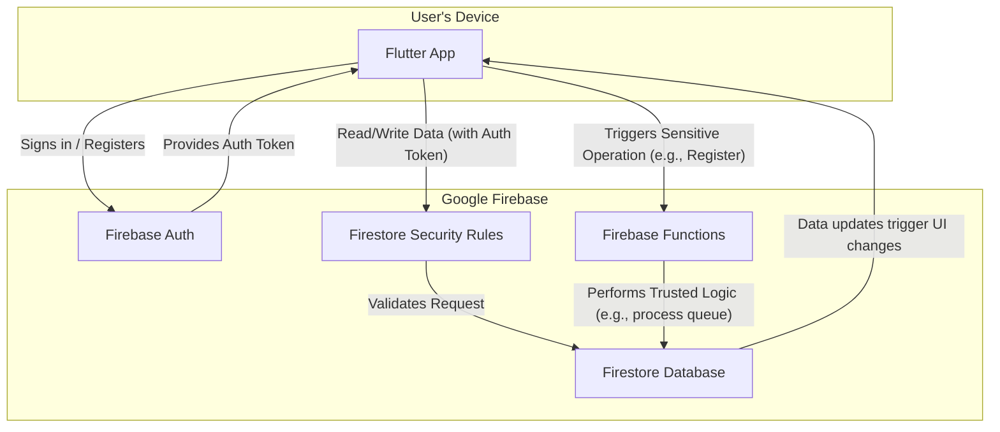

# GetSpot High-Level Architecture

This document outlines the basic architectural model for the GetSpot application, detailing the flow of data and control between the client, authentication, database, and backend logic.

## Architectural Flow Explained

*   **Authentication:** The user signs in or registers via the **Flutter App**, which communicates with **Firebase Auth**.
*   **Auth Token:** Firebase Auth returns a secure ID Token to the app. This token is sent with all subsequent requests to prove the user's identity.
*   **Direct Database Access:** For simple, safe operations (like reading event details or updating a user's own profile), the Flutter App makes a request directly to **Firestore**.
*   **Security Rules:** **Firestore Security Rules** intercept every direct request. They check the user's Auth Token and other conditions (e.g., `request.auth.uid == userId`) to allow or deny the operation. This is the primary security layer.
*   **Sensitive Operations:** For complex or sensitive actions (like registering for an event, which requires checking spots, balance, and updating counts), the Flutter App calls a specific **Firebase Function**.
*   **Trusted Backend Logic:** The **Firebase Function**, running in a secure server environment, executes the complex logic. It has privileged access to Firestore to perform necessary reads and writes (e.g., creating a "requested" document, then processing it to change the status to "Confirmed" or "Waitlisted").
*   **Real-time Updates:** The Flutter App listens for real-time changes in the **Firestore Database**, so when the Firebase Function updates a user's registration status, the UI on the user's device updates automatically.

This model ensures that the client is only responsible for the presentation layer, while all critical business logic and security enforcement happens on the backend.
