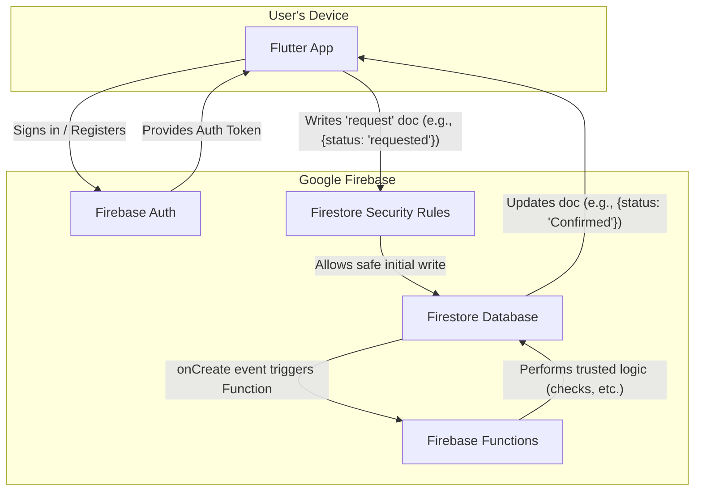

# GetSpot High-Level Architecture

This document outlines the "write-to-trigger" architectural model for the GetSpot application, detailing the flow of data and control between the client, database, and backend logic.

## Architectural Patterns

The application employs two primary architectural patterns for interacting with the backend, each suited for different use cases.

### 1. Write-to-Trigger Pattern (for Event Registration)

This architecture uses a **"write-to-trigger"** pattern for handling asynchronous, multi-step operations like event registration.

*   **Initial Write:** The Flutter App performs a simple, fast write to Firestore to create a new document representing the user's intent (e.g., `/events/{eventId}/participants/{userId}` with a status of `"requested"`).
*   **Security Rules:** **Firestore Security Rules** allow this specific write operation, but only if the status is `"requested"`. The rules deny any attempt by the client to write `"Confirmed"` directly.
*   **Function Trigger:** An `onCreate` **Firebase Function** is triggered by the new document.
*   **Trusted Backend Logic:** The Function executes all the complex validation logic in a secure environment: checking wallet balances, verifying spot availability, and ensuring fairness.
*   **Final Update & Real-time Sync:** The Function updates the participant document with the final status (`"Confirmed"`, `"Waitlisted"`, etc.). The app's real-time listener automatically updates the UI.

This model is highly scalable and robust. The initial write acts as a durable request queue within Firestore, and the user gets immediate feedback while the complex logic runs securely in the background.

### 2. Callable Function Pattern (for Group Creation)

For atomic, synchronous operations like creating a new group, the application uses a **Firebase Callable Function**. This approach centralizes logic and enhances security.

*   **Client Call:** The Flutter app calls a specific function (e.g., `createGroup`) and passes the required data (name, description). The Firebase SDK automatically attaches the user's authentication token to the request.
*   **Backend Execution:** The `createGroup` function runs in a secure environment. It performs the following steps:
    1.  **Authentication:** Verifies the user's identity using the `context.auth` object provided by the Firebase SDK. If the user is not authenticated, the function exits immediately.
    2.  **Generate Unique Code:** Creates a unique, shareable `groupCode`, ensuring there are no collisions with existing groups.
    3.  **Create Documents:** Creates the new group document in the `/groups` collection and adds the creator to the `/members` subcollection in a single atomic operation.
    4.  **Return Data:** Returns the new `groupId` and `groupCode` to the client app.

This pattern is ideal for operations that need to be performed as a single, transactional step, guaranteeing data integrity and uniqueness.

---

## Timezone Handling

To ensure all timestamps are consistent and unambiguous, the application will adhere to the following strategy:

*   **Storage in UTC:** All date and time information stored in Firestore (e.g., `eventTimestamp`, `commitmentDeadline`, `createdAt`) will be saved in **UTC (Coordinated Universal Time)**. Firestore's native `Timestamp` data type handles this automatically.
*   **Display in Local Time:** The Flutter client is responsible for all timezone conversions. When displaying a timestamp to a user, it will be converted from UTC to the user's current device timezone. When an organizer creates an event, the app will convert their local input time to UTC before sending it to the backend.

This "store in UTC, display in local" approach is a standard best practice that prevents ambiguity, correctly handles Daylight Saving Time, and future-proofs the application for users in different geographical locations.

---

## Firebase Resource Configuration

To ensure data locality and consistent performance, all Firebase resources for this project, including Firestore and Firebase Functions, will be deployed in the **Northern Virginia (us-east4)** region.
