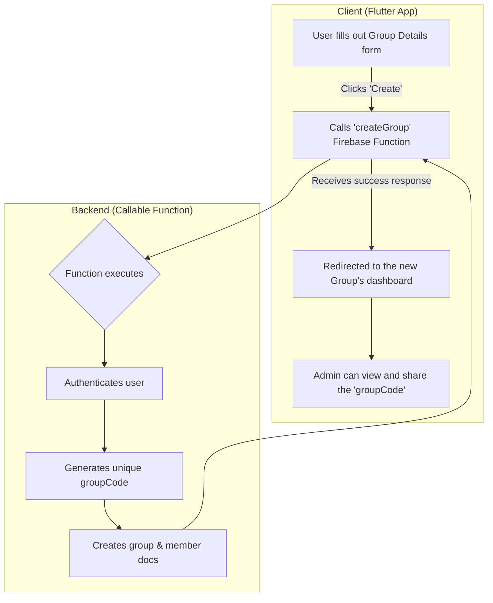
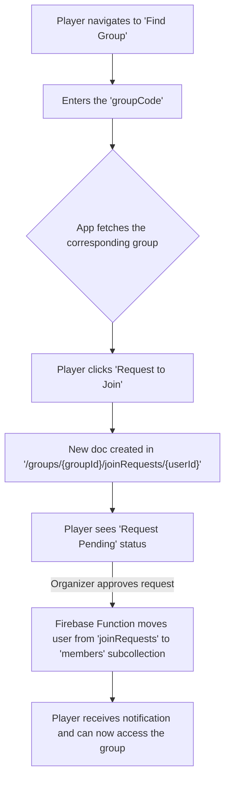
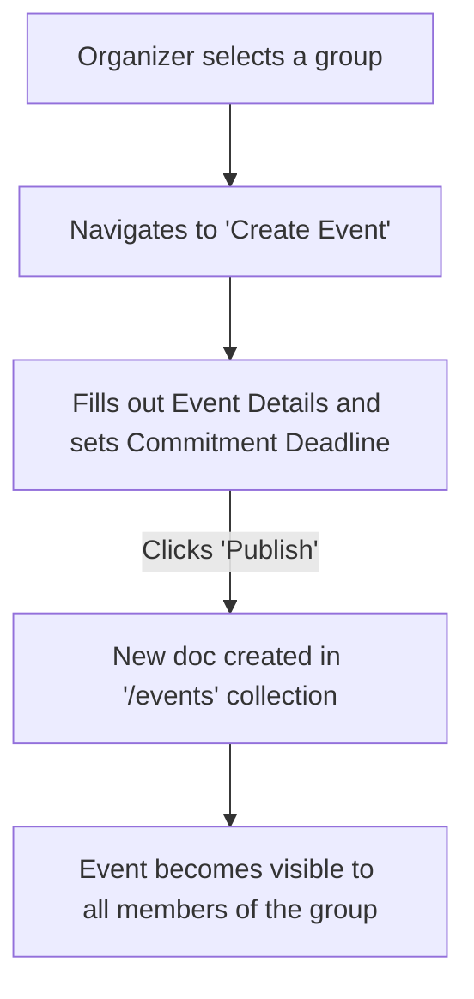

# User Journeys

This document outlines the key user flows in the GetSpot application, based on the defined requirements and data model.

## 1. User Authentication (Google Sign-In)

This is the primary entry point for all users. The system uses Firebase Authentication with Google Sign-In.

**Associated Roles:** All Users
**Associated Screens:** `LoginScreen`, `HomeScreen`

### Flow Diagram

---

## 2. New User Creates a Group

This flow describes how a user creates a new community, becoming its default administrator.

**Associated Roles:** Organizer
**Prerequisite:** User is authenticated.

### Flow Diagram

---

## 3. Player Joins a Group

This flow describes how a player joins a group.

**Associated Roles:** Player
**Prerequisite:** User is authenticated.

### Flow Diagram

---

## 4. Organizer Creates an Event

This flow describes how an organizer creates an event within a group they manage.

**Associated Roles:** Organizer
**Prerequisite:** User is an admin of the group.

### Flow Diagram

---

## 5. Player Registers for an Event

This flow describes how a player registers for an event, highlighting the "write-to-trigger" pattern.

**Associated Roles:** Player
**Prerequisite:** User is a member of the group where the event is hosted.

### Flow Diagram

