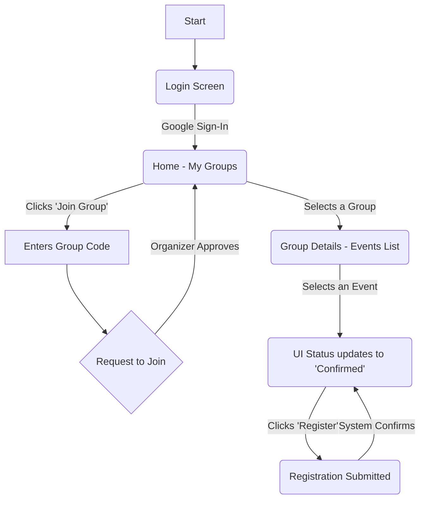
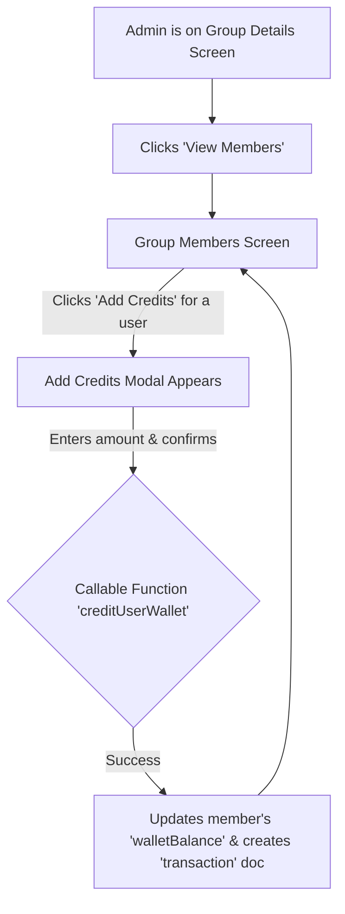

# GetSpot Wireframes

This document provides low-fidelity wireframes for the key screens in the GetSpot application, based on the project's requirements and user journeys.

---

### **1. Login Screen (`login_screen.dart`)**

The initial screen for all users. Authentication is handled exclusively through Google Sign-In.

# GetSpot Wireframes

This document provides low-fidelity wireframes for the key screens in the GetSpot application, based on the project's requirements and user journeys.

---

### **1. Login Screen (`login_screen.dart`)**

The initial screen for all users. Authentication is handled exclusively through Google Sign-In.

```text
+-------------------------------------------+
|                                           |
|          [Badminton Logo]                 |
|          Welcome to GetSpot               |
|                                           |
+-------------------------------------------+
|                                           |
|                                           |
|      [ G ]  Sign in with Google           |
|                                           |
|                                           |
+-------------------------------------------+
```

---

### **2. Home / My Groups Screen**

After login, the user sees a list of groups they are a member of. This is the main dashboard.

```text
+-------------------------------------------+
| My Groups                [Profile Icon]   |
+-------------------------------------------+
|                                           |
|  +-------------------------------------+  |
|  | Badminton Crew      >               |  |
|  | Members: 15                         |  |
|  +-------------------------------------+  |
|                                           |
|  +-------------------------------------+  |
|  | Friday Night Smashers >             |  |
|  | Members: 8                          |  |
|  +-------------------------------------+  |
|                                           |
+-------------------------------------------+
| [ Join a Group ]   [ Create a Group ]     |
+-------------------------------------------+
```

---

### **3. Group Details / Events Screen**

This screen shows the details of a specific group, including a list of upcoming events.

```text
+-------------------------------------------+
| < Badminton Crew         [Admin Options]  |
+-------------------------------------------+
|                                           |
|  Upcoming Events:                         |
|  +-------------------------------------+  |
|  | Friday Game @ 8pm   >               |  |
|  | Confirmed: 10/12  Waitlist: 2       |  |
|  +-------------------------------------+  |
|                                           |
|  +-------------------------------------+  |
|  | Sunday Practice     >               |  |
|  | Confirmed: 4/8    Waitlist: 0       |  |
|  +-------------------------------------+  |
|                                           |
+-------------------------------------------+
| [ View Members ]   [ Create New Event ]   |
+-------------------------------------------+
```

---

### **4. Event Details Screen**

Displays all information for a single event, and is where a user can register.

```text
+-------------------------------------------+
| < Friday Game @ 8pm                       |
+-------------------------------------------+
|                                           |
|  Location: City Sports Center             |
|  Time: Friday, Aug 15, 8:00 PM            |
|  Fee: 10 credits                          |
|  Commitment Deadline: Thursday @ 10pm     |
|                                           |
|  Confirmed (10/12):                       |
|  - Alice, Bob, Charlie, ...               |
|                                           |
|  Waitlist (2):                            |
|  - Frank, Grace                           |
|                                           |
+-------------------------------------------+
| [ Register ]         Status: Not Registered |
+-------------------------------------------+
```

---

### **5. Profile & Wallet Screen**

Allows the user to view their wallet balance and sign out.

```text
+-------------------------------------------+
| < Profile                                 |
+-------------------------------------------+
|                                           |
|  Name: Amit R                             |
|  Email: amit.r@example.com                |
|                                           |
|  +-------------------------------------+  |
|  | Wallet Balance (Overall)            |  |
|  | Note: Balances are per-group.       |  |
|  +-------------------------------------+  |
|                                           |
|                                           |
+-------------------------------------------+
| [ Sign Out ]                              |
+-------------------------------------------+
```

---

### **6. Core User Flow**

This diagram shows the primary journey for a player joining a group and registering for an event.



---

### **7. Admin - Add Credits to Member Wallet**

This flow shows how a group organizer credits virtual currency to a participant's account. This typically happens after an offline payment.

#### **7.1. Group Members Screen (Admin View)**
Accessed via the "[ View Members ]" button on the Group Details screen.

```text
+-------------------------------------------+
| < Badminton Crew - Members                |
+-------------------------------------------+
|                                           |
|  +-------------------------------------+  |
|  | Alice               Balance: 100  |  |
|  |                     [Add Credits] |  |
|  +-------------------------------------+  |
|                                           |
|  +-------------------------------------+  |
|  | Bob                 Balance: 50   |  |
|  |                     [Add Credits] |  |
|  +-------------------------------------+  |
|                                           |
+-------------------------------------------+
| [ Back to Events ]                        |
+-------------------------------------------+
```

#### **7.2. Add Credits Modal**
This modal appears when the admin clicks "[ Add Credits ]".

```text
+-------------------------------------------+
|                                           |
|           Add Credits to Alice            |
|                                           |
|  Amount: [_________]                      |
|                                           |
|  Description (Optional): [_________]      |
|                                           |
|         [ Cancel ]  [ Confirm ]           |
|                                           |
+-------------------------------------------+
```

#### **7.3. Admin Credit Flow**




---

### **2. Home / My Groups Screen**

After login, the user sees a list of groups they are a member of. This is the main dashboard.

```text
+-------------------------------------------+
| My Groups                [Profile Icon]   |
+-------------------------------------------+
|                                           |
|  +-------------------------------------+  |
|  | Badminton Crew      >               |  |
|  | Members: 15                         |  |
|  +-------------------------------------+  |
|                                           |
|  +-------------------------------------+  |
|  | Friday Night Smashers >             |  |
|  | Members: 8                          |  |
|  +-------------------------------------+  |
|                                           |
+-------------------------------------------+
| [ Join a Group ]   [ Create a Group ]     |
+-------------------------------------------+
```

---

### **3. Group Details / Events Screen**

This screen shows the details of a specific group, including a list of upcoming events.

```text
+-------------------------------------------+
| < Badminton Crew         [Admin Options]  |
+-------------------------------------------+
|                                           |
|  Upcoming Events:                         |
|  +-------------------------------------+  |
|  | Friday Game @ 8pm   >               |  |
|  | Confirmed: 10/12  Waitlist: 2       |  |
|  +-------------------------------------+  |
|                                           |
|  +-------------------------------------+  |
|  | Sunday Practice     >               |  |
|  | Confirmed: 4/8    Waitlist: 0       |  |
|  +-------------------------------------+  |
|                                           |
+-------------------------------------------+
| [ View Members ]   [ Create New Event ]   |
+-------------------------------------------+
```

---

### **4. Event Details Screen**

Displays all information for a single event, and is where a user can register.

```text
+-------------------------------------------+
| < Friday Game @ 8pm                       |
+-------------------------------------------+
|                                           |
|  Location: City Sports Center             |
|  Time: Friday, Aug 15, 8:00 PM            |
|  Fee: 10 credits                          |
|  Commitment Deadline: Thursday @ 10pm     |
|                                           |
|  Confirmed (10/12):                       |
|  - Alice, Bob, Charlie, ...               |
|                                           |
|  Waitlist (2):                            |
|  - Frank, Grace                           |
|                                           |
+-------------------------------------------+
| [ Register ]         Status: Not Registered |
+-------------------------------------------+
```

---

### **5. Profile & Wallet Screen**

Allows the user to view their wallet balance and sign out.

```text
+-------------------------------------------+
| < Profile                                 |
+-------------------------------------------+
|                                           |
|  Name: Amit R                             |
|  Email: amit.r@example.com                |
|                                           |
|  +-------------------------------------+  |
|  | Wallet Balance (Overall)            |  |
|  | Note: Balances are per-group.       |  |
|  +-------------------------------------+  |
|                                           |
|                                           |
+-------------------------------------------+
| [ Sign Out ]                              |
+-------------------------------------------+
```

---

### **6. Core User Flow**

This diagram shows the primary journey for a player joining a group and registering for an event.

